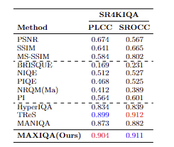

# MaxIQA: MaxViT backbone with Channel Attention and Self-Attention for Blind Image Quality Assessment

Shawn Lee (Supervised by Aaron Zhang)

[University of Bristol Computer Vision Lab](https://vilab.blogs.bristol.ac.uk/research/computer-vision/)

## Network Architecture

## Main Contributions
- Hybrid Backbone Integration: Identified effective MaxViT feature maps that capture local and global distortions, highlighting the strength of hybrid architectures for IQA.
- Feature Refinement Modules: Merged additional modules to refine intermediate features from MaxViT, improving the quality representation.
- Robust BIQA Model: Developed a BIQA model that generalises well across datasets, showing strong intra- and cross-dataset performance.

## Checkpoints
The pretrained model checkpoints are provided [here](https://drive.google.com/drive/folders/1fFv3BFGcDvrerYEMK9wWPuJzqtF9aRN_?usp=drive_link).

## Environment Setup
### Hardware Environment
- GPU: NVIDIA RTX 4080 with 16GB memory

### Software Environment
- Platform: Pytorch 2.2.0
- Language: Python 3.9.21
- Extra: Numpy 1.26.4, OpenCV 4.11.0, Pandas 2.2.3, Scikit-learn 1.6.1
- CUDA Version: CudatoolKit 11.8

## Datasets

## Benchmark Code

## Usage

## Results

## Acknowledgement
This code borrows parts from [MANIQA](https://github.com/IIGROUP/MANIQA#) and [timm](https://github.com/rwightman/pytorch-image-models).
