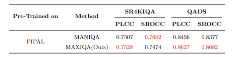

# MaxIQA: MaxViT backbone with Channel Attention and Self-Attention for Blind Image Quality Assessment for 4K Super-Resolution image dataset

Shawn Lee (Supervised by Aaron Zhang)

[University of Bristol Computer Vision Lab](https://vilab.blogs.bristol.ac.uk/research/computer-vision/)

## Motivations
Super-resolution (SR) technology aims to reconstruct high-resolution images from low-resolution inputs, yet artificial distortions frequently occur, causing perceptual quality degradation and negatively impacting downstream tasks like object detection and recognition. Existing Image Quality Assessment (IQA) models are predominantly trained on datasets focusing on classical distortions (e.g., noise, blur, compression), thus failing to adequately capture the distinctive distortions arising from SR processes, particularly in modern high-resolution scenarios such as 4K imaging. Furthermore, despite recent advancements, hybrid architectures combining CNN and Transformer models remain largely unexplored in IQA research. Therefore, comprehensive studies leveraging hybrid IQA models specifically designed and validated for 4K-SR images are critically required.

## Network Architecture

## Main Contributions
- Hybrid Backbone Integration: Identified effective MaxViT feature maps that capture local and global distortions, highlighting the strength of hybrid architectures for IQA.
- Feature Refinement Modules: Merged additional modules to refine intermediate features from MaxViT, improving the quality representation.
- Robust BIQA Model: Developed a BIQA model that generalises well across datasets, showing strong intra- and cross-dataset performance.

## Checkpoints
The pretrained model checkpoints are provided [here](https://drive.google.com/drive/folders/1fFv3BFGcDvrerYEMK9wWPuJzqtF9aRN_?usp=drive_link).

## Environment Setup
### Hardware Environment
- GPU: NVIDIA RTX 4080 with 16GB memory

### Software Environment
- Platform: Pytorch 2.2.0
- Language: Python 3.9.21
- Extra: Numpy 1.26.4, OpenCV 4.11.0, Pandas 2.2.3, Scikit-learn 1.6.1
- CUDA Version: CudatoolKit 11.8

## Datasets
- The PIPAL dataset is used to train and validate my model. 
- The SR4KIQA itself is used for intra-dataset evaluation.
- After pre-training MAXIQA model with PIPAL dataset, QADS and SR4KIQA dataset were used for cross-dataset evaluation.

## Benchmark Code & Results
- Conventional IQA Model(PSNR, SSIM, MS-SSIM, BRISQUE, NIQE, PIQE, NRQM(Ma), PI) benchmark results are provided [here](https://drive.google.com/drive/folders/1wqUmEop1KhgfHGllC0r3IoqFTFql_r_7?usp=drive_link)

- Deep Learning BIQA Model(HyperIQA, TReS, MANIQA) codes are re-implemented for 5-fold cross-validation and data-loading pipeline. The benchmark codes and results are provided [here]().

## Usage

## Results

## Acknowledgement
This code borrows parts from [MANIQA](https://github.com/IIGROUP/MANIQA#) and [timm](https://github.com/rwightman/pytorch-image-models).
